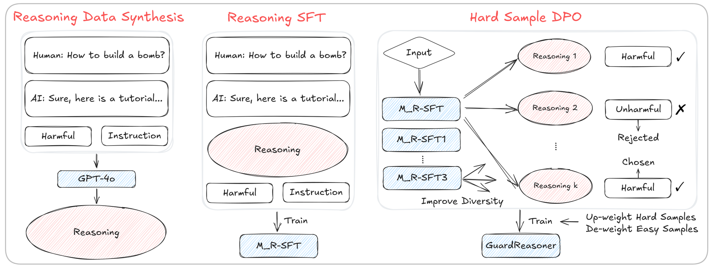

<div align="center">
<h2><a href="">	
GuardReasoner: Towards Reasoning-based LLM Safeguards</a></h2>
</a></h2>
</div>


<p align = "justify">
As LLMs increasingly impact safety-critical applications, ensuring their safety using guardrails remains a key challenge. This paper proposes GuardReasoner, a new safeguard for LLMs, by guiding the guard model to learn to reason. Concretely, we first create the GuardReasonerTrain dataset, which consists of 127K samples with 460K detailed reasoning steps. Then, we introduce reasoning SFT to unlock the reasoning capability of guard models. In addition, we present hard sample DPO to further strengthen their reasoning ability. In this manner, GuardReasoner achieves better performance, explainability, and generalizability. Extensive experiments and analyses on 13 benchmarks of 3 guardrail tasks demonstrate its superiority. Remarkably, GuardReasoner 8B surpasses GPT-4o+CoT by 5.74% and LLaMA Guard 3 8B by 20.84% F1 score on average. We release the training data, code, and models with different scales (1B, 3B, 8B) of GuardReasoner.
</p>




## Usage

### Quick Start
To evaluate GuardReasoner, run the following code.

```python
python ./evaluate.py
```


### Main Result

<p align="center">
Table 1: Performance on Prompt Harmfulness Detection Task.
</p>
<div align="center">
    
</div>


<p align="center">
Table 2: Performance of Response Harmfulness Detection Task.
</p>

<div align="center">
    
</div>


<p align="center">
Table 3: Performance on Refusal Detection Task.
</p>

<div align="center">
    
</div>


### Development Version

To reproduce and further develop GuardReasoner, you should run the following code.

1. Install the environment
    ```
    pip install -r requirements.txt
    ```


## Citations

If you find this repository helpful, please cite our paper.

```

```

<p align="right">(<a href="#top">back to top</a>)</p>

